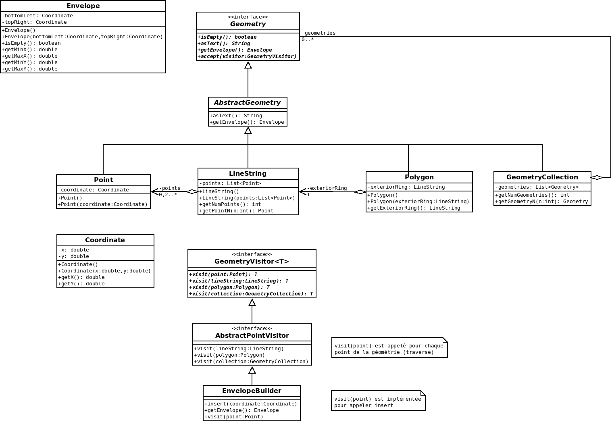

# TP design pattern

Application de quelques patrons de conception à des classes géométriques (standard OGC Simple Feature simplifié).

## Modèle de données

## Explication

Voir [CHANGELOG.md](CHANGELOG.md).

# Dans la vraie vie...

Voir [JTS Topology Suite JTS](http://tsusiatsoftware.net/jts/main.html) en Java.

